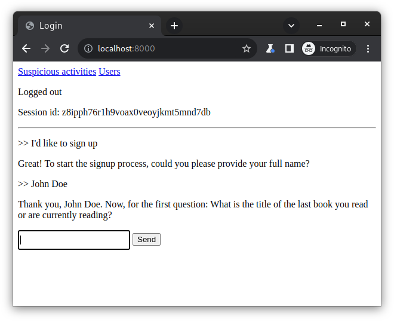

# gpt4_auth : Using the GPT4 api to authenticate users based on personal questions

# Features
* Login
* Logout
* List of registered users
* Reports of attempts to access another user's account

# Usage
1. Add your Openai API key to `docker-compose.yml`
2. `docker-compose up -d`
3. Access `http://localhost:8000` in a browser. The server takes a few seconds to start up.
4. You can ask to signup, login or logout in the input.